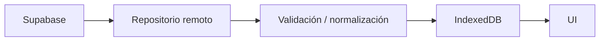
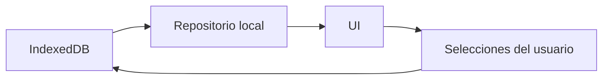

# Arquitectura de PoliPlan

PoliPlan es una PWA offline-first construida con Vite + React + TypeScript.

## Capas

1. **UI (`pages`, `components`)** — renderiza vistas y delega estado a providers.
2. **Estado de dominio (`features/schedule`)** — selecciones, filtros y métricas del horario.
3. **Repositorios (`repositories`)** — única vía de lectura de datos oficiales.
4. **Persistencia local (`db`)** — IndexedDB con Dexie.
5. **Sincronización (`services/scheduleSyncService`)** — compara versiones y actualiza caché.
6. **Remoto (`lib/supabase`)** — cliente público de Supabase, sin `service_role`.

## Flujo online

## Flujo offline

## Reglas

- La UI nunca consulta Supabase directamente.
- El Service Worker cachea el app shell, no los horarios académicos.
- Si una sincronización falla, se conserva la última copia válida en IndexedDB.
- Las selecciones del usuario se guardan localmente aunque no haya sesión.

## Autenticación futura

Se reservaron tablas `profiles`, `user_schedules` y `user_schedule_sections` con RLS por usuario. En esta versión la app funciona sin login y sincroniza sólo datos oficiales.
